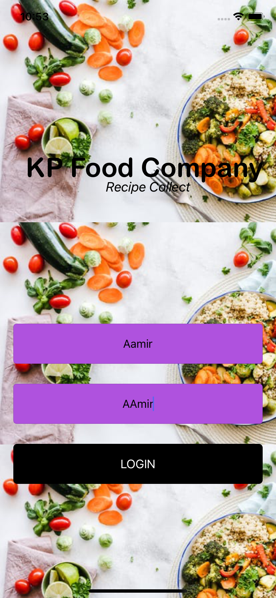
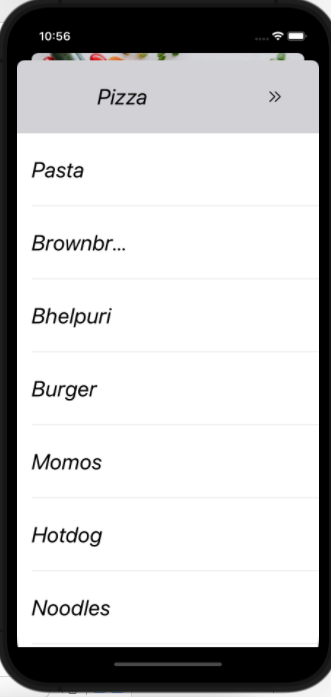

# Recipe-App
This Appliaction mainly provide serch recipe via web view interface.

First user authentication is require.

If username and Password is correct then it will open new viewController
There is list of food items in table formate.
if you any item is select from the table new view controller will open.
This view controller will load the details of that food in webview formate.

Note: Web view is based on Weki Pedia
